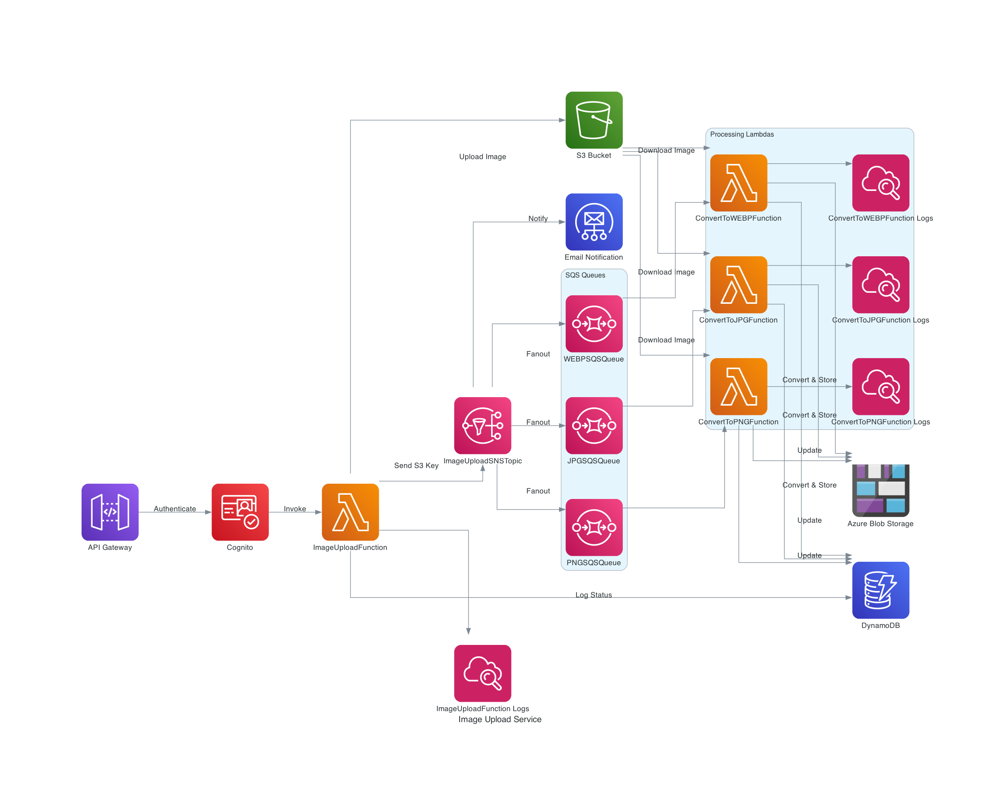

# CloudConvert: Serverless Multi-Cloud Image Conversion Pipeline

## What's inside
This project spins up serverless cloud infrastructure designed to convert user uploaded images into various different formats such as PNG, JPG, and WEBP. The project uses Terraform and leverages various AWS and Azure services such as API Gateway, Cognito User Pools, Lambda, S3, DynamoDB, SNS, SQS, and Azure Blob storage to achieve this. The IaC code uses fanout design for parallel processing and is designed in modular format encapsulating identical groups of resources with reusable code for future projects.

## Architecture Diagram


## Table of Contents
- [Modules](#modules)
  - [S3](#s3)
  - [SNS](#sns)
  - [Cognito](#cognito)
  - [API Gateway](#api-gateway)
  - [DynamoDB](#dynamodb)
  - [SQS](#sqs)
  - [Lambda](#lambda)
  - [Azure Blob](#azure-blob)
- [How to Run](#how-to-run)
- [Multiple Environments](#multiple-environments)

## Modules

### Lambda
- **Path:** `modules/lambda`
- **Description:** 
  - Manages several Lambda functions for image processing:
    - `ImageUploadFunction`: Receives the message from the API Gateway, handles image uploads to S3, updates the DynamoDB table with the upload status, and publishes a message to an SNS topic for notifications and further processing via SQS
    - `ConvertToJPGFunction`: Receives the message from the `sqs_jpg_queue` SQS queue containing the S3 key, retrieves the stored image from S3, converts it to JPG format, uploads the image to Azure Blob storage, and updates the DynamoDB table with the blob name of the converted image stored in Azure Blob 
    - `ConvertToWEBPFunction`: Receives the message from the `sqs_webp_queue` SQS queue containing the S3 key, retrieves the stored image from S3, converts it to WEBP format, uploads the image to Azure Blob storage, and updates the DynamoDB table with the blob name of the converted image stored in Azure Blob 
    - `ConvertToPNGFunction`: Receives the message from the `sqs_png_queue` SQS queue containing the S3 key, retrieves the stored image from S3, converts it to PNG format, uploads the image to Azure Blob storage, and updates the DynamoDB table with the blob name of the converted image stored in Azure Blob  
  - Configures IAM roles and policies for Lambda execution
  - Sets up Lambda layers for additional dependencies such as `Pillow` Python library for imaging and `Azure` to interact with Azure to upload to Blob storage
  - Integrates with S3, DynamoDB, SQS, and Azure Blob storage for retrieving, processing and storing images in different formats

### S3
- **Path:** `modules/s3`
- **Description:** 
  - Creates an S3 bucket using a randomly generated ID to store the source images uploaded by the user
  - Manages S3 bucket policies and configurations

### SNS
- **Path:** `modules/sns`
- **Description:** 
  - Sets up an SNS topic for email notifications and image processing via SQS
  - Creates 4 subscriptions with 1 email and 3 SQS queues as endpoints for email notifications and sending messages to SQS for image conversion

### Cognito
- **Path:** `modules/cognito`
- **Description:** 
  - Configures a Cognito User Pool and User Pool Client for user authentication
  - Manages IAM roles and policies necessary for API Gateway to authorize users via Cognito

### API Gateway
- **Path:** `modules/api_gateway`
- **Description:** 
  - Deploys an API Gateway REST API with resources, methods, and integrations
  - Configures the integration with Lambda functions to handle API requests
  - Sets up an authorizer using Cognito User Pools for securing API endpoints

### DynamoDB
- **Path:** `modules/dynamodb`
- **Description:** 
  - Provisions a DynamoDB table for storing application data
  - Configures read/write capacity settings and table attributes
  - Ensures the table is set up with necessary indexes and throughput

### SQS
- **Path:** `modules/sqs`
- **Description:** 
  - Creates SQS queues for different image formats to handle message processing
  - Configures policies and permissions for Lambda functions to process messages from these queues
  - Integrates with SNS to receive notifications and process them asynchronously

### Azure Blob
- **Path:** `modules/azure_blob`
- **Description:** 
  - Manages Azure Blob Storage resources
  - Creates and configures storage accounts and containers
  - Ensures secure access and proper configuration for storing and retrieving blobs

## How to Run

### Prerequisites
- Install Terraform: [Terraform Installation Guide](https://learn.hashicorp.com/terraform/getting-started/install.html)
- Configure AWS CLI: [AWS CLI Configuration](https://docs.aws.amazon.com/cli/latest/userguide/cli-configure-quickstart.html)
- Configure Azure CLI: [Azure CLI Configuration](https://learn.microsoft.com/en-us/cli/azure/get-started-tutorial-1-prepare-environment?tabs=bash)

### Steps
1. **Initialize the project:**
   ```bash
   terraform init
2. **Preview the resources to be created:**
   ```bash
   terraform plan
3. **Create resources:**
   ```bash
   terraform apply
4. Upon successful run, you will receive the endpoint URL associated with the API Gateway and the Bearer Token for authentication 

5. **Destroy resources:**
   ```bash
   terraform destroy
## Multiple Environments
In order to deploy this infrastructure in multiple environments without duplicating the code and while maintaining distinct Terraform state files, I'd recommend using Terraform Workspaces
1. **Create a new workspace:**
   ```bash
   terraform workspace new workspacenew
2. **Switch to the new workspace:**
   ```bash
   terraform workspace select workspacenew 
3. **List workspaces:**
   ```bash
   terraform workspace list 
4. **Delete a workspace:**
   ```bash
   terraform workspace select default 
   terraform workspace delete workspacenew 